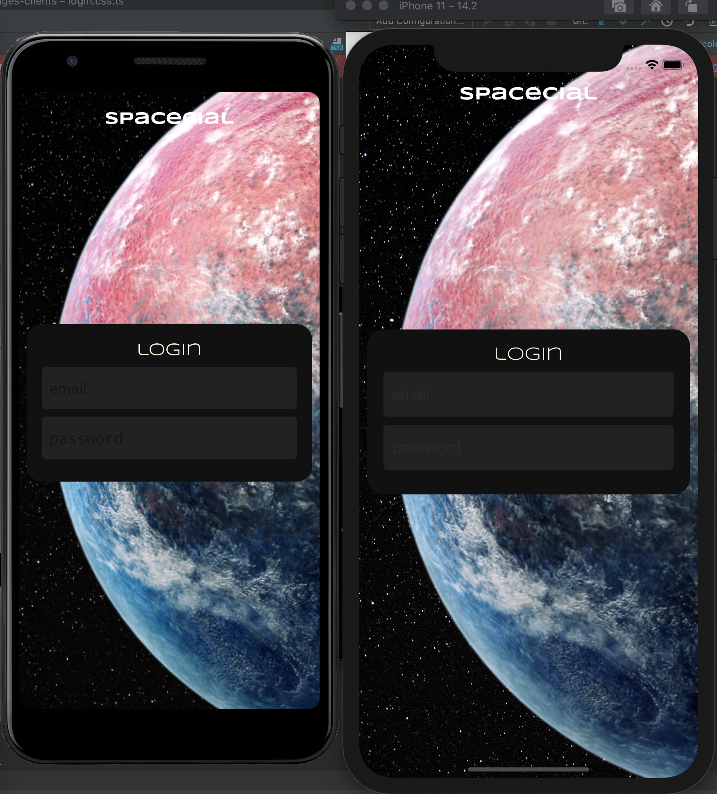

# Spececial
A hypothetical social network for space colonists called "Spacecial". 
This is an experimental/learning/best practices gathering, nonprofitable project, aiming to collect best practices of code reuse between multiple platforms: web, Android and IOS.

## Technologies
- React native
- React
- TypeScript
- CSS-in-JS
- Redux
- Redux saga
- Yarn workspaces

## API
[https://github.com/DmitriyNoa/social-messages-clients](https://github.com/DmitriyNoa/social-messages-clients)

## Requirements
- XCode
- cocoapods
- yarn
- NodeJS

## Installation
- Clone the repo `git clone git@github.com:DmitriyNoa/social-messages-clients.git` .
- CD into the project `cd social-messages-clients`.
- Install dependencies `yarn install`.
- Install pods `cd mobile-client/ios`, `pod install`.

## Running
### Mobile client
- IOS
    - `cd mobile-client`
    - `yarn ios`
- Android
    - `cd mobile-client`
    - `yarn android`
### WEB client
- `cd web-client`
- `yarn serve`

## Features list plan
- Register user 
- [x] Login
- Post a text message
- Explore/search other users
- Follow/unfollow other users
- See messages feed
- Post an image message
- Post a video message
- Post a video message
